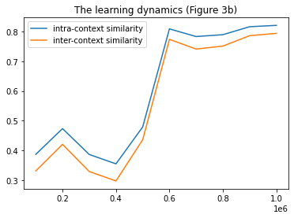

# Contextual Representation Learning beyond Masked Language Modeling (Replication)

Here, I try to replicate the observed learning dynamics in the ACL 2022 paper [Contextual Representation Learning beyond Masked Language Modeling](https://aclanthology.org/2022.acl-long.193/). Specifically, I aim to reproduce Figure 3b.

Differences between the implementation of the original paper (code not released) and mine are:
- I use RoBERTa pre-training checkpoints.
- I use part of the pre-training corpus (2K sentences) instead of the full one. It does not make sense to use the full corpus as claimed by the paper. 
- The range of pre-training steps is different (100K to 1M instead of 0 to 20K).

Thus, I don't get a similar result. In the figure below, the x-axis represents the number of pre-training steps.

